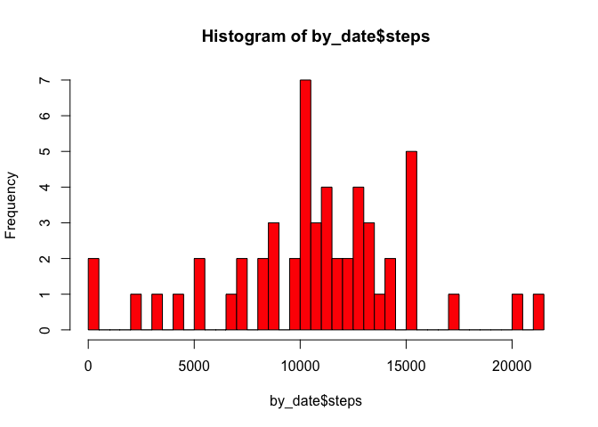
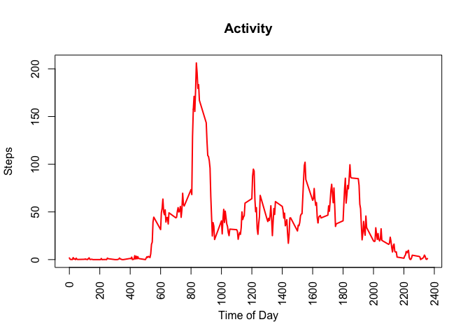
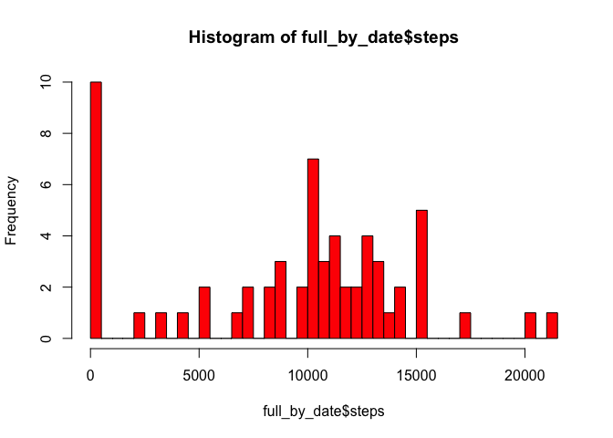
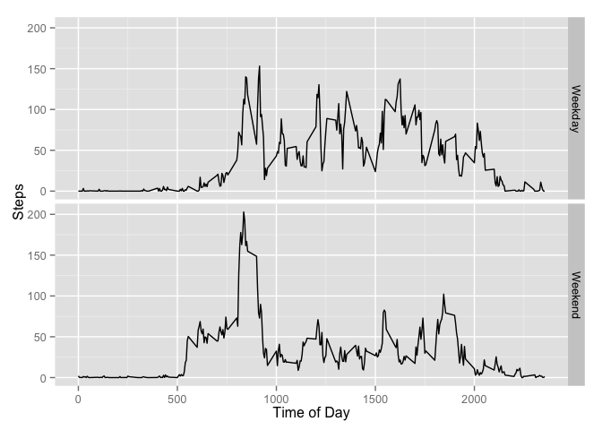

# Reproducible Research: Peer Assessment 1


## Loading and preprocessing the data


```r
## environmentals
library("lubridate")
library("plyr")
```

```
## 
## Attaching package: 'plyr'
## 
## The following object is masked from 'package:lubridate':
## 
##     here
```

```r
library("dplyr")
```

```
## 
## Attaching package: 'dplyr'
## 
## The following objects are masked from 'package:plyr':
## 
##     arrange, count, desc, failwith, id, mutate, rename, summarise,
##     summarize
## 
## The following objects are masked from 'package:lubridate':
## 
##     intersect, setdiff, union
## 
## The following objects are masked from 'package:stats':
## 
##     filter, lag
## 
## The following objects are masked from 'package:base':
## 
##     intersect, setdiff, setequal, union
```

```r
library("ggplot2")

## go get the file and read it in
url <- "https://d396qusza40orc.cloudfront.net/repdata%2Fdata%2Factivity.zip"
destfile <- "data_activity.zip"
download.file(url, destfile=destfile, method = "curl")
unzip(destfile)
activity <- read.csv("activity.csv")

## fix the dates
activity$date <- ymd(activity$date)
```


## What is mean total number of steps taken per day?

*Total number of steps per day:*

```r
## cleanup
by_date <- summarize(group_by(activity, date), sum(steps))
colnames(by_date) <- c("date", "steps")
by_date
```

```
## Source: local data frame [61 x 2]
## 
##          date steps
## 1  2012-10-01    NA
## 2  2012-10-02   126
## 3  2012-10-03 11352
## 4  2012-10-04 12116
## 5  2012-10-05 13294
## 6  2012-10-06 15420
## 7  2012-10-07 11015
## 8  2012-10-08    NA
## 9  2012-10-09 12811
## 10 2012-10-10  9900
## ..        ...   ...
```

*Histogram of total number of steps per day:*

```r
hist(by_date$steps, col = "red", breaks=40)
```

 

*Mean and median number of steps per day:*

```r
mean(as.numeric(by_date$steps), na.rm=TRUE)
```

```
## [1] 10766.19
```

```r
median(as.numeric(by_date$steps),na.rm=TRUE)
```

```
## [1] 10765
```


## What is the average daily activity pattern?

*Time series plot of 5 minute intervals and average number of steps taken, averaged across all days:*

```r
by_interval <- summarize(group_by(activity,interval), mean(as.numeric(steps),na.rm=TRUE))
colnames(by_interval) <- c("interval","steps")

plot(by_interval$interval,by_interval$steps, type="n", xaxt="n", ylab="Steps", xlab="Time of Day")
title(main="Activity")
axis(1,xaxp=c(0,2400,12),las=2)
points(by_interval$interval,by_interval$steps, type="l", lwd=2, col=2)
```

 

*Identify interval containing maximum number of steps on average across all days in the dataset:*

```r
by_interval[by_interval$steps==max(by_interval$steps),]
```

```
## Source: local data frame [1 x 2]
## 
##   interval    steps
## 1      835 206.1698
```

## Imputing missing values

*How many missing values?*

```r
sum(is.na(activity$steps))
```

```
## [1] 2304
```

*Strategy for imputing missing values:* I assumed the NA values to be 0 (e.g., the wearer was asleep). I assume that is the only way for the totals and sums to still work out.

*Create a new dataset that is equal to the original dataset but with the missing data filled in:*

```r
activityfull <- read.csv("activity.csv")
activityfull$date <- ymd(activityfull$date)
activityfull$steps[is.na(activityfull$steps)] <- 0
```

*Histogram of total steps taken each day:*

```r
full_by_date <- summarize(group_by(activityfull, date), sum(steps))
colnames(full_by_date) <- c("date", "steps")
hist(full_by_date$steps, col = "red", breaks=40)
```

 

*Mean and median total steps taken each day:*

```r
mean(as.numeric(full_by_date$steps), na.rm=TRUE)
```

```
## [1] 9354.23
```

```r
median(as.numeric(full_by_date$steps),na.rm=TRUE)
```

```
## [1] 10395
```
*Analysis:* The total steps taken each day is unchanged (as that was my strategy for assigning 0.) However, the mean and median values have decreased, which was not the intended result. And the histogram profile has changed - there are many more days with 0 steps. This has corrupted the original data. 


## Are there differences in activity patterns between weekdays and weekends?
*Use modified data set and assign new two-factor variable indicating whether date is weekend or weekday*

```r
tmp <- mutate(activityfull,weekday=weekdays(date))
weekenddays <- c("Saturday","Sunday")
tmp$half <- ifelse(tmp$weekday %in% weekenddays, "Weekday", "Weekend")
```

*Plot time series by 5-minute interval (x-axis) of the average number of steps taken, averaged across all weekday days or weekend days (y-axis):*

```r
by_interval_weekends <- summarize(group_by(tmp,half,interval), mean(as.numeric(steps),na.rm=TRUE))
colnames(by_interval_weekends) <- c("half","interval","steps")

qplot(interval, steps, data = by_interval_weekends, facets = half ~ ., xlab="Time of Day", ylab = "Steps", geom="line")
```

 

*Analysis:* Person wearing this activity tracker is much more active during the daytime on weekends. He or she must have a sedentary job or have a very active weekend lifestyle.
